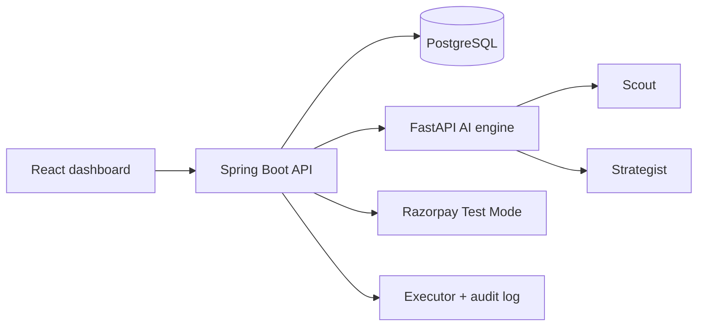

# Merchant Autopilot
### AI Revenue Manager for Razorpay Merchants

Merchant Autopilot turns a revenue goal into explainable, approval-gated growth campaigns. It uses Scout to find opportunities, Strategist to plan offers, and Executor to create Razorpay Test Mode links only after merchant approval. It never charges automatically.

## Architecture

## Run locally

1. Create PostgreSQL database and run `database/schema.sql`, then generate and run the seed data with `python database/seed.py` followed by `psql "$DATABASE_URL" -f database/seed.sql`.
2. Start AI: `cd ai-engine && pip install -r requirements.txt && uvicorn main:app --reload --port 8000`.
3. Start API: `cd backend && mvn spring-boot:run`.
4. Start UI: `cd frontend && npm install && npm run dev`.

The UI includes a realistic demo mode and works without credentials. Add credentials to connect real services.

The generated seed contains exactly 500 customers, 100 products, and 2,000 transactions. JPA entities are under `backend/src/main/java/com/merchantautopilot/domain` and mirror every schema table, including the composite `campaign_targets` key.

After updating an existing database, run `psql -U postgres -d merchant_autopilot -f database/migration-001-auth.sql` once before restarting the backend. Fresh databases should run `schema.sql` followed by `seed.sql`.

Backend authentication endpoints are `POST /api/auth/register` and `POST /api/auth/login`. Send the returned JWT as `Authorization: Bearer <token>` to merchant endpoints. Razorpay links are created only for approved campaigns and use Test Mode credentials from `RAZORPAY_KEY_ID` and `RAZORPAY_KEY_SECRET`.

## Environment

`DATABASE_URL`, `DB_USERNAME`, `DB_PASSWORD`, `AI_ENGINE_URL`, `RAZORPAY_KEY_ID`, `RAZORPAY_KEY_SECRET`, and `OPENAI_API_KEY`.

## API surface

`POST /api/goals`, `GET /api/plan`, `POST /api/campaigns`, `POST /api/campaigns/{id}/approve`, `POST /api/payments/create-link`, `POST /api/payments/verify`, `GET /api/customers`, `GET /api/dashboard`, `GET /api/audit`.

AI endpoints: `/analyze`, `/plan`, `/recommend`, `/predict-discount`, `/digital-twin`, `/explain`.

## Demo script

Set a goal of INR 2,00,000 with max discount 15%, review confidence and margin impact, approve one strategy, open the generated Test Mode payment link, then inspect attribution and the audit timeline. Expired links retry once and stop after the second failure.

## Screenshots

Add `docs/screenshots/dashboard.png`, `strategy.png`, and `audit.png` for submission packaging.
